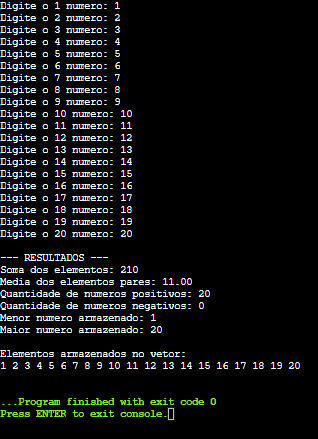

# Atividade - Arrays em C

## Identificação

**Aluno:** Luiz Filipe de Melo Dias  
**Curso:** Análise e Desenvolvimento de Sistemas  
**Linguagem utilizada:** C  

---

## Objetivo

Desenvolver um programa em linguagem C para praticar o uso de arrays, estruturas de repetição, estruturas condicionais, entrada de dados e operações matemáticas.

---

## Descrição da atividade

O programa permite que o usuário digite 20 números inteiros e armazena esses valores em um vetor.

Depois disso, o programa:

- Calcula a soma de todos os números;
- Calcula a média dos números pares;
- Mostra quantos números são positivos;
- Mostra quantos números são negativos;
- Mostra o menor número;
- Mostra o maior número;
- Exibe todos os números armazenados no vetor.

O número zero não é considerado positivo nem negativo.

Caso não existam números pares, o programa informa que não é possível calcular a média.

---

## Lógica utilizada

Foi criado um vetor com 20 posições para armazenar os números digitados.

O programa utiliza um `for` para ler os 20 valores.

Durante a leitura, ele:

- Soma os números;
- Verifica quais são pares;
- Conta os positivos;
- Conta os negativos;
- Identifica o maior valor;
- Identifica o menor valor.

No final, outro `for` é usado para mostrar todos os números armazenados.

---

## Exemplo de execução

Foram digitados os números de 1 até 20.

Resultados obtidos:

- Soma dos elementos: 210
- Média dos elementos pares: 11.00
- Quantidade de números positivos: 20
- Quantidade de números negativos: 0
- Menor número armazenado: 1
- Maior número armazenado: 20

---

## Captura de tela

